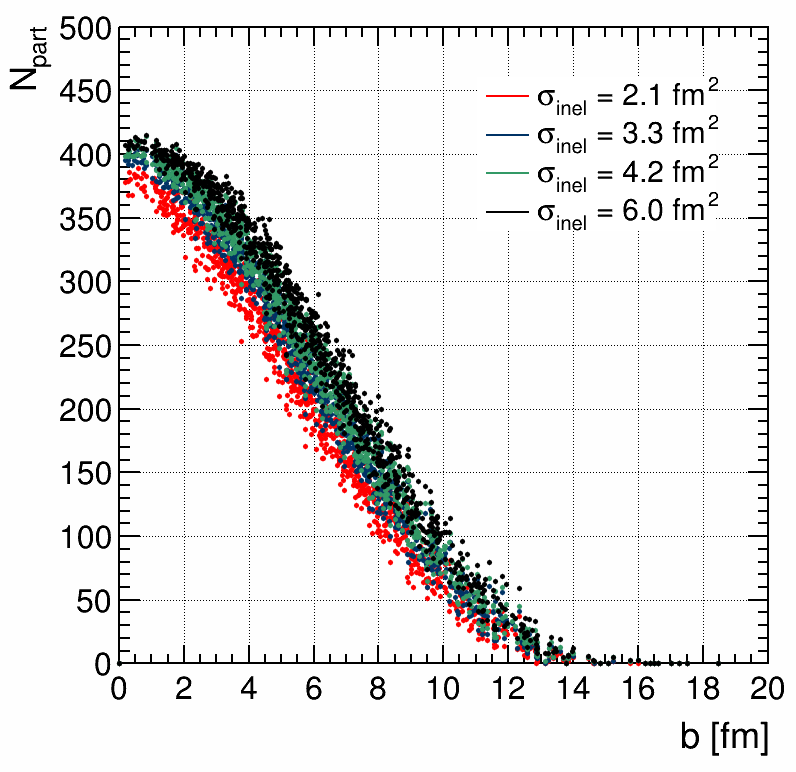
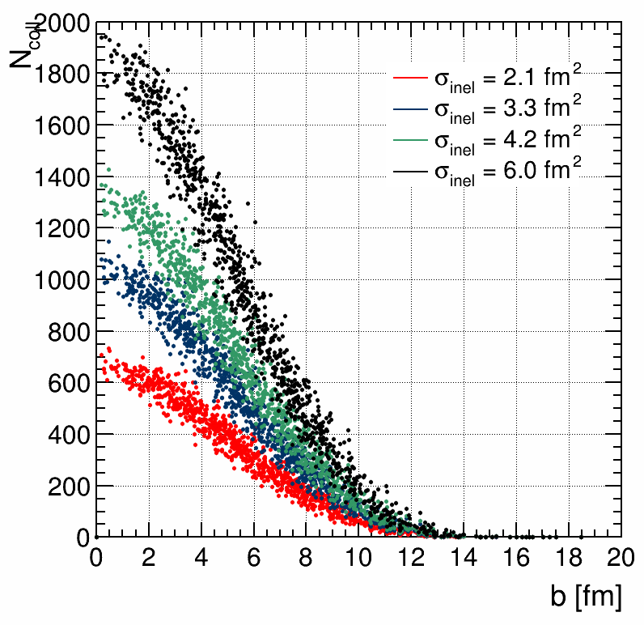

# Glauber Model Simulation

This repository contains the code to run a Monte Carlo simulation of the Glauber Model.

## The Glauber Model

The Glauber Model is a theoretical framework widely used in nuclear and particle physics to describe the initial stage of high-energy collisions between heavy ions. Named after Roy J. Glauber, who developed it in the late 1950s, the model provides a statistical description of the distribution of nucleons within colliding nuclei. It assumes a simple geometric picture of the nucleus, treating nucleons as classical objects. One key assumption is that nucleon-nucleon collisions are independent. This model is particularly useful to provide quantitative infor.

## Simulation Results

As shown in the figures below, the results obtained from the simulation depict the values of Npart (the number of participating nucleons) and Ncoll (the number of binary nucleon-nucleon collisions) for lead-lead collisions. The simulation was conducted under various assumptions regarding inelastic cross sections, specifically chosen to correspond to the ones reached at the AGS, SPS, RHIC, and LHC energies.

|| 
|:--:| 
|Figure 1: Number of participants for lead-lead collisions with different inelastic cross sections|

|| 
|:--:| 
|Figure 2: Number of binary nucleon-nucleon collision for lead-lead interactions with different inelastic cross sections|

These figures provide a visual representation of the impact of varying inelastic cross sections on the participating nucleons and collision outcomes. Analyzing these results can offer valuable insights into the sensitivity of the Glauber Model to different physical parameters.

Feel free to explore the code, adjust parameters, and further customize the simulation to suit your specific research questions.

